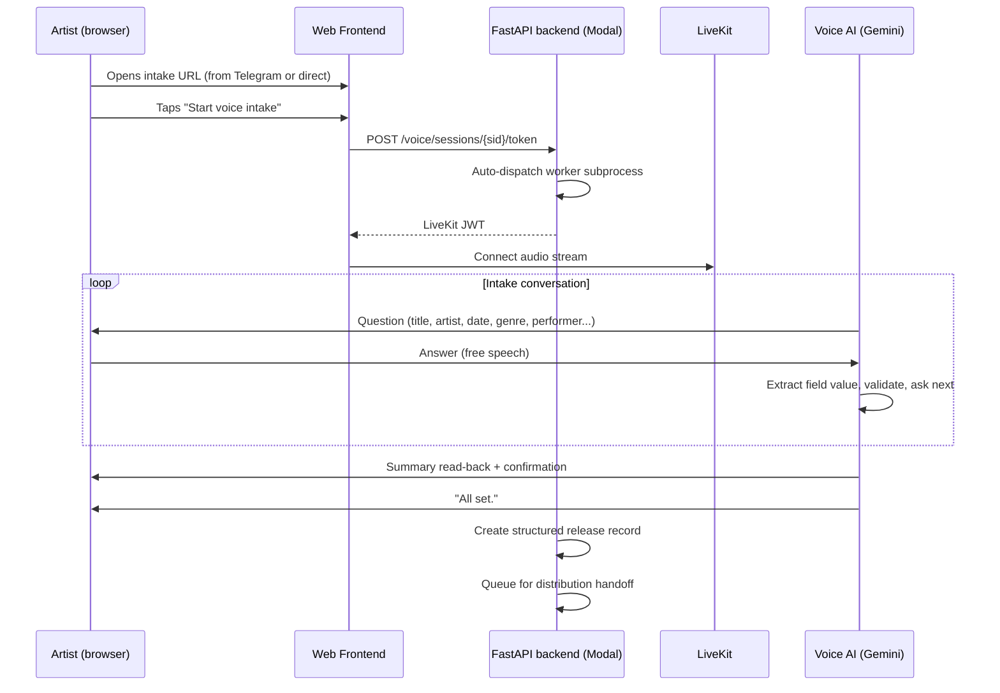
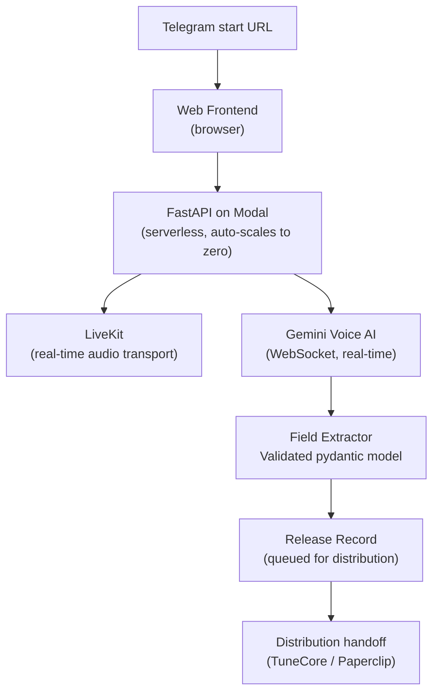

# muse-voice

> Voice-first music release intake: AI interviews artists about their release in real-time, extracts structured metadata, and queues it for distribution.

[](https://python.org)
[](https://livekit.io)
[](https://modal.com)
[]()
[]()

Getting release metadata from artists is slow: emails, forms, back-and-forth. Muse Voice replaces that with a 3-minute voice conversation. The artist talks, the agent listens and asks follow-up questions, and the release record is ready when the call ends.

---

## Live demo (what the agent actually says)

```
Agent: "Hello, I'm Muse. What is the title and the artist name for this release?"
Artist: "It's called Sunset Drive, by Sarah Lane."
Agent: "Got it. Sunset Drive by Sarah Lane. What is the release date?"
...
Agent: "All set. Sunset Drive by Sarah Lane, a single released October 9th, 2026. 
        Please send your audio and artwork via Telegram."
```

---

## Conversation flow



---

## Fields collected

| Field | How collected |
|---|---|
| Release title | Direct question |
| Main artist name | Direct question |
| Release date | Direct question + date parsing |
| Release type | Classification (single, EP, album) |
| Primary genre | Direct question |
| Songwriter | Direct question |
| Performer(s) | Direct question, multi-value |
| Producer / Engineer | Direct question |

---

## Architecture



---

## Implementation status

| Component | Status | Notes |
|---|---|---|
| Voice intake v1.2 | Shipped | 113 tests passing, confirmed live in browser |
| Auto-dispatch worker | Shipped | Worker spawned on session create, not on /token |
| Cold-start pre-warm | Planned | Reduce 15-22s initial delay to ~0s |
| Distribution handoff | Planned | Paperclip / TuneCore wiring |

---

Built by [Joy Dong](https://www.joydong.org)
