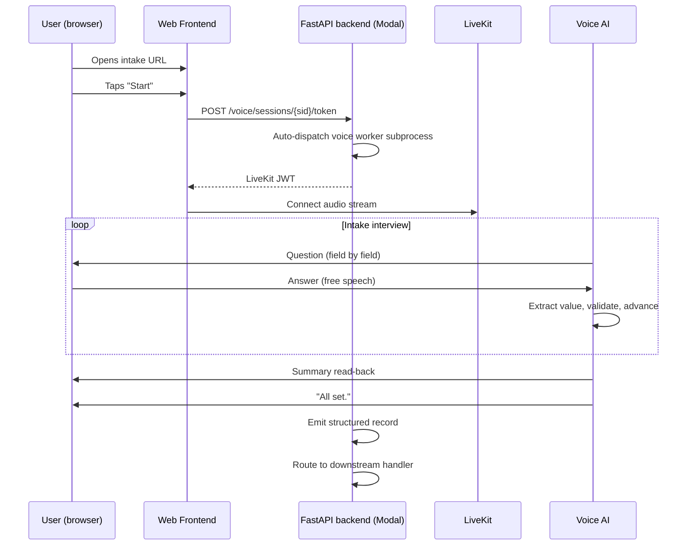
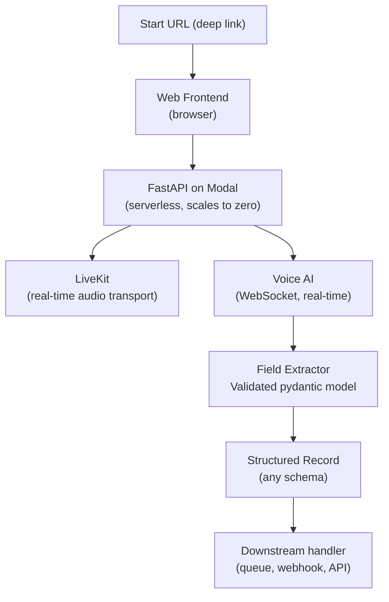

# voice-intake-structured

> Voice-first intake agent: AI interviews users in real-time, collects structured data across any field set, and delivers a validated record — no forms, no typing.

[](https://python.org)
[](https://livekit.io)
[](https://modal.com)
[]()

Forms are slow and imprecise. This agent replaces them: the user speaks naturally, the agent asks follow-up questions for any missing fields, reads back a summary for confirmation, and produces a validated structured record — all in under 3 minutes.

---

## Live demo (actual agent transcript)

```
Agent: "What is the title and the name for this record?"
User:  "It's called Sunset Drive, by Sarah Lane."
Agent: "Got it — Sunset Drive by Sarah Lane. What is the date?"
...
Agent: "All set. I have everything I need."
```

---

## Conversation flow



---

## Architecture



---

## Field collection model

The field schema is config-driven — define the fields you need and the agent asks for them in order, handling re-asks and clarifications automatically.

| Field property | Type | Notes |
|---|---|---|
| `key` | string | Stable identifier for the structured record |
| `label` | string | What the agent calls this field in conversation |
| `field_type` | text / date / enum / number | Used for validation |
| `required` | bool | Agent re-asks until satisfied if true |
| `confirmation_read` | bool | Agent reads back this field in the summary |

---

## Implementation status

| Component | Status |
|---|---|
| Voice intake v1.2 | Shipped — 113 tests, confirmed live in browser |
| Auto-dispatch worker | Shipped |
| Cold-start pre-warm | Planned |
| Downstream handler wiring | Configurable per deployment |

---

Built by [Joy Dong](https://www.joydong.org)
